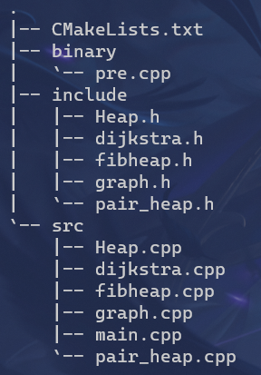
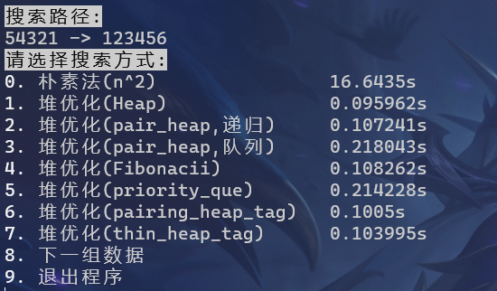
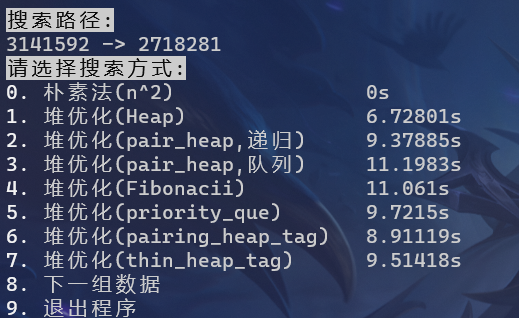
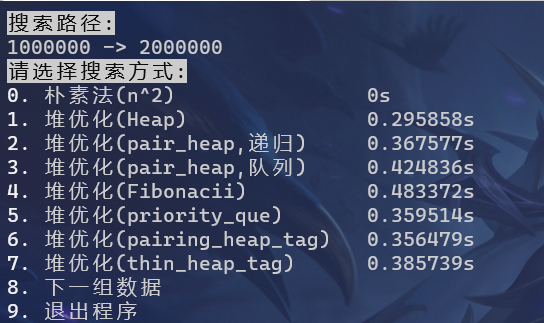

# 导航软件

#### 一、实验要求

​	要求在所给的数据集上建立图结构（邻接矩阵或者邻接表），并在建立的图结构上自行实现Dijkstra算 法求解任	意两点之间的最短路径。

- 输入输出要求：

    Input : src(源点)   Dst(目标点)

    Output :

    ​	(1) 最短路径的长度： distance
    
    ​	(2) Src到Dsr的一条最短路径，例如：Src->p1->p2->p3->...->Dst(逆序输入也对)

#### 二、实验目的，

​	熟悉并掌握图的建立算法和Dijkstra求图上最短路径算法，了解Dijkstra算法的改进方法，掌 握时间复杂度的分	析方法并且去分析对比验证不同时间复杂度的Dijkstra算法的时间开销，了解稀疏的图结构的压缩存储方法。

#### 三、程序能实现的功能

- 对数据文件进行二进制处理，同时少量压缩二进制文件
- 根据数据文件建立图结构(邻接表)
- 使用朴素法，二叉堆，配对堆，fibonacii堆搜索最短路径，对于大数据测试样例，搜索时间能够进入10s

#### 四、设计思路

- 预处理
    - 将原数据文件转换为二进制形式
    - 建立图的邻接表，将图按顺序输出，同一个出发点的边只记录以此源点，用度数来标记下一个源点
- dijkstra
    - 建立`visited`与`distance`数组
    - 初始`visited`数组置0，`distance`数组置最大(由于`memset()`的限制，稍小于`INT_MAX`)
    - 将源点距离设为0，访问设为1，遍历所有与源点相连的边，记录距离进入distance数组
    - 从distance数组中找出distance最短的点，记为$u$，遍历所有与$u$相连的边，相连的点记为$v_1,v_2,...,v_n$，如果$visited[v_i]==0\& distance[v_i]>distance[u]+weight_{u->v}$，更新$distance[v_i]$的值
    - 重复上述操作，知道$visited[Dst]==1$或者整个图已搜索完毕，仍然没有找到路径
    - 逆序输出最短路径

#### 五、项目结构



#### 六、文件的具体实现

- 预处理

    - 二进制

        ```c++
        void input::begin_binary()
        {
            auto loc = data_info.find('.');
            out_info = data_info.substr(0, loc) + "_pre.txt";
            std::ifstream infile(data_info.c_str(), std::ios::in);
            std::ofstream outfile(out_info.c_str(), std::ios::out | std::ios::binary);
            if (!infile || !outfile)
            {
                return;
            }
            int num1, num2, info;
        
            printf("\033[?25l");
            std::string line;
            while (getline(infile, line))
            {
                std::cout << "\r" << line;
                auto linestream = std::istringstream(line);
                linestream >> num1 >> num2 >> info;
                outfile.write((char *)&num1, sizeof(int));
                outfile.write((char *)&num2, sizeof(int));
                outfile.write((char *)&info, sizeof(int));
            }
            printf("\033[?25h");
            infile.close();
            outfile.close();
        }
        ```

    - 压缩

        ​	根据邻接表直接二进制输出图的数据

- dijkstra

    - **main.cpp**

        不同函数的调用，与用户交互

    - **graph.h**和**graph.cpp**

        类及函数的定义

        ```c++
        typedef struct ArcNode
        {
            int adjvex;
            int weight;
            struct ArcNode *nextarc;
        } ArcNode;
        struct VNode
        {
            int vex_data;
            ArcNode *firstarc;
        };
        class AGraph
        {
        private:
            int vexnum;
            struct ArcNode *last_ptr;
        public:
            std::vector<VNode *> data;
            AGraph();
            ~AGraph();
            bool input(int x, int y, int info);  //输入数据
            bool input_(int x, int y, int info); //输入数据(用于压缩输入)
            int get_vex();                       //返回点数
        };
        ```

        + **bool input(int x,int y,int info)**

            ```c++
            bool AGraph::input(int x, int y, int info)
            {
                std::cout << "\r" << x << " " << y << " " << info;
                if (data[x] == nullptr)
                {
                    vexnum++;
                    struct VNode *first_init = new VNode;
                    first_init->vex_data = x;
                    first_init->firstarc = nullptr;
                    data[x] = first_init;
                }
                struct ArcNode *p = new ArcNode;
                p->nextarc = nullptr;
                p->weight = info;
                p->adjvex = y;
            
                struct ArcNode *q = data[x]->firstarc;
                if (q == nullptr)
                {
                    data[x]->firstarc = p;
                    last_ptr = p;
                    return true;
                }
                while (q->nextarc != nullptr)
                    q = q->nextarc;
                q->nextarc = p;
            
                last_ptr = p;
                return true;
            }
            ```
        
    - **dijkstra.h**和**dijkstra.cpp**

        函数定义

        ```c++
        
        struct node
        {
            int begin;
            int distance;
            node()
            {
                begin = 0;
                distance = 0;
            };
            node(int a, int b)
            {
                begin = a;
                distance = b;
            };
            friend bool operator>(struct node n1, struct node n2)
            {
                return n1.distance < n2.distance;
            }
            friend bool operator<(struct node n1, struct node n2)
            {
                return n1.distance > n2.distance;
            }
        };
        struct cmp
        {
            bool operator()(struct node x, struct node y)
            {
                return x.distance > y.distance;
            }
        };
        int find_min(std::unordered_map<int, int> &dis_map, int vis[]);
        clock_t dijkstra(AGraph &G, int x, int y);               //朴素算法
        clock_t dijkstra_heap(AGraph &G, int x, int y);          //二叉堆
        clock_t dijkstra_fibheap(AGraph &G, int x, int y);       //Fibonacci堆
        clock_t dijkstra_pair_heap(AGraph &G, int x, int y);     //配对堆（递归）
        clock_t dijkstra_pair_heap_0(AGraph &G, int x, int y);   //配对堆（队列）
        clock_t dijkstra_heap_gnu(AGraph &G, int x, int y);      // pbds库 优先队列
        clock_t dijkstra_pair_heap_gnu(AGraph &G, int x, int y); // pbds库 配对堆
        clock_t dijkstra_thin_heap_gnu(AGraph &G, int x, int y); // pbds库 Fibonacci堆
        ```

        - **clock_t dijkstra_heap(AGraph &G, int x, int y)**  (所有搜索除了使用的数据结构不同，剩下实现部分基本相同，只举一个介绍)

            ```c++
            clock_t dijkstra_heap(AGraph &G, int x, int y)
            {
                int *visited = new int[100000000];
                memset(visited, 0, sizeof(int) * 100000000);
                int *dis = new int[100000000];
                memset(dis, 127, sizeof(int) * 100000000);
                int *pre = new int[100000000];
                memset(pre, -1, sizeof(int) * 100000000);
                Heap<struct node> q;
                dis[x] = 0;
                q.push(node(x, dis[x]));
            
                while (!q.empty())
                {
                    struct node now = q.top();
                    q.pop();
                    if (visited[now.begin] == 1)
                        continue;
                    visited[now.begin] = 1;
                    if (now.begin == y)
                        break;
                    struct ArcNode *p = G.data[now.begin]->firstarc;
                    while (p != nullptr)
                    {
                        if (visited[p->adjvex] != 1 && dis[p->adjvex] > dis[now.begin] + p->weight)
                        {
                            dis[p->adjvex] = dis[now.begin] + p->weight;
                            q.push(node(p->adjvex, dis[p->adjvex]));
                            pre[p->adjvex] = now.begin;
                        }
                        p = p->nextarc;
                    }
                }
            
                clock_t endtime = clock();
                
                if (visited[y] != 1)
                {
                    std::cout << "不能到达!" << std::endl;
                    delete[] visited;
                    delete[] dis;
                    delete[] pre;
                    return endtime;
                }
                int road = y;
                while (road != -1)
                {
                    printf("\033[0;30;47m%d\033[0m ", road);
                    road = pre[road];
                    if (road != -1)
                        std::cout << "<- ";
                    else
                        printf("\n");
                }
                std::cout << "\nOutput:\n" << dis[y] << std::endl;
            
                delete[] visited;
                delete[] dis;
                delete[] pre;
            
                return endtime;
            }
            ```

    - **heap.h**和**heap.cpp**
      类的定义及重要函数内容

      ```c++
      template <class T>
      class Heap
      {
      private:
          std::vector<T> data;
          int length;
      public:
          Heap();
          ~Heap();
          inline void swim(int k);      //上浮
          inline void sink(int k);      //下沉
          inline void push(T e);        //入堆
          inline void pop();            //出堆
          inline T top();               //返回堆顶元素
          inline bool empty();          //判断是否为空
          inline int size();            //返回大小
          inline void swap(T &a, T &b); //交换元素
      };
      ```

      - 实现思路

          使用vector存储数据，下标为0的点不用，这样下表为$n$的数据，双亲为$\frac{n}{2}$，孩子为$2n$和$2n+1$，每次入堆，在结围加入元素，然后最后一个元素上浮，出堆，将最后一个元素和第一个元素交换，删除最后一个元素，将第一个元素下沉，此时push和pop都是$logn$的

      - **void push(T e)**  

          ```c++
          template <class T>
          inline void Heap<T>::push(T e)
          {
              data.push_back(e);
              length++;
              swim(length);
          }
          ```

      - **void pop()**

          ```c++
          inline void Heap<T>::pop()
          {
              swap(data[1], data[length--]);
              data.pop_back();
              sink(1);
          }
          ```

      - **void swim(int k)**

          ```c++
          template <class T>
          inline void Heap<T>::swim(int k) //上浮
          {
              while (k > 1 && data[k] > data[k / 2])
              {
                  swap(data[k], data[k / 2]);
                  k /= 2;
              }
          }
          ```

      - **void sink(int k)**

          ```c++
          template <class T>
          inline void Heap<T>::sink(int k) //下沉
          {
              while (k * 2 <= length)
              {
                  int j = 2 * k;
                  if (j < length && (data[j] < data[j + 1])) //找到左右子树中更小的
                      j++;
                  if (data[k] > data[j])
                      break;
                  swap(data[k], data[j]);
                  k = j;
              }
          }
          ```

    - **pair_heap.h**和**pair_heap.cpp**

        类的定义及重要函数实现

        ```c++
        template <class T>
        class pair_node
        {
        public:
            T val;
            int left;
            int right;
            pair_node()
            {
                left = 0;
                right = 0;
            }
            pair_node(T e)
            {
                val = e;
                left = 0;
                right = 0;
            }
        };
        template <class T>
        class pair_heap
        {
        private:
            std::vector<pair_node<T>> data;
            int length; //已经到达的vector地址
            int _size;  //实际存储的大小
            inline void merge(int x, int y);
            inline int merges(int x, int y);
            int root;
            inline int pop_();
        
        public:
            pair_heap();
            ~pair_heap();
            inline void push(T e);
            inline void pop();
            inline void _pop();
            inline T top();
            inline bool empty();
            inline int size();
        };
        ```

        - 实现思路

            使用vector储存节点，节点的元素包含左右孩子的下标，以及自身的值，配对堆的核心操作是merge操作，即将两棵树合并，有递归和队列两种方法，push操作即将新节点与原来的root节点进行一次merge操作，复杂度是$O(1)$的，pop操作是将根节点的去除，将他的每一个孩子merge在一起，其中merge操作分为两种，递归merge和队列merge

            - **void merge(int x,int y)** 

                ```c++
                template <class T>
                inline void pair_heap<T>::merge(int x, int y)
                {
                    if (!x || !y)
                        root = x + y;
                    else if (x == y)
                        root = x;
                    else
                    {
                        if (data[x].val < data[y].val)
                        {
                            int temp = x;
                            x = y;
                            y = temp;
                        }
                        data[y].right = data[x].left;
                        data[x].left = y;
                        data[x].right = 0;
                        root = x;
                    }
                }
                ```

            - **int merges(int x,int y)** (递归用merge，除了返回root外和上述merge完全相同)

            - **void push(T e)**

                ```c++
                template <class T>
                inline void pair_heap<T>::push(T e)
                {
                    pair_node<T> temp(e);
                    data.push_back(temp);
                    length++;
                    merge(root, length);
                    _size++;
                }
                ```

            - **void pop()** (队列 pop)

                ```c++
                template <class T>
                inline void pair_heap<T>::pop()
                {
                    if (_size == 0)
                    {
                        std::cout << "为空!" << std::endl;
                        return;
                    }
                    if (data[root].left == 0)
                        root = 0;
                    else if (data[data[root].left].right == 0)
                        root = data[root].left;
                    else
                    {
                        std::queue<int> que;
                        int now = root;
                        que.push(data[now].left);
                        now = data[now].left;
                        while (data[now].right != 0)
                        {
                            que.push(data[now].right);
                            now = data[now].right;
                        }
                        int _que_size = que.size();
                        while (_que_size >= 2)
                        {
                            int a = que.front();
                            que.pop();
                            int b = que.front();
                            que.pop();
                            merge(a, b);
                            que.push(root);
                            _que_size--;
                        }
                    }
                    _size--;
                }
                ```

            - **void \_pop()** (递归pop)

                ```c++
                template <class T>
                inline void pair_heap<T>::_pop()
                {
                    root = pop_();
                    _size--;
                }
                template <class T>
                inline int pair_heap<T>::pop_()
                {
                    if (_size == 0)
                    {
                        std::cout << "为空!" << std::endl;
                        return 0;
                    }
                    if (data[root].left == 0)
                        return 0;
                    else if (data[data[root].left].right == 0)
                        return data[root].left;
                    else
                    {
                        int son1 = data[root].left;
                        int son2 = data[data[root].left].right;
                        data[root].left = data[data[data[root].left].right].right;
                        return merges(merges(son1, son2), pop_());
                    }
                }
                ```

    - **fibheap.h**和**fibheap.cpp**

        类的定义及重要函数内容

        ```c++
        template <typename T>
        struct fib_node
        {
            struct fib_node<T> *parent;
            struct fib_node<T> *child;
            struct fib_node<T> *left;
            struct fib_node<T> *right;
            T key;
            int degree;
            fib_node() : parent(nullptr), child(nullptr), left(this), right(this), degree(0), mark(false) {}
        };
        template <class T>
        class FibHeap
        {
        private:
            int keyNum;
            int maxDegree;
            struct fib_node<T> *min;
            struct fib_node<T> **cons;
            void removeNode(struct fib_node<T> *node);//剔除该节点
            void addNode(struct fib_node<T> *node, struct fib_node<T> *root);
            void consolidate();//合并
            struct fib_node<T> *extractMin();//抽出最小节点对应的树
            void makeCons();//开辟空间
            void link(struct fib_node<T> *node, struct fib_node<T> *root);//合并节点时，相同度数节点的合并
            void theEnd(struct fib_node<T> *node);//用于释放空间
        public:
            FibHeap();
            ~FibHeap();
            void push(T e);
            void pop();
            bool empty();
            int size();
            T top();
        };
        ```

        - 实现思路

            由于只需要使用入堆和出堆，所以对fibonacii堆的内容进行了一定的简化，fibonacii堆是一颗树，兄弟节点之间可以当作双向循环链表，push操作直接在根节点所在的双向循环链表中加入该节点，根据大小更新根节点，pop操作同配对堆类似，但合并的是根节点的孩子以及根节点的兄弟，此时需要引入辅助节点
            
            - **void  push(T e)**
            
                ```c++
                template <class T>
                void FibHeap<T>::push(T e)
                {
                    struct fib_node<T> *temp = new struct fib_node<T>;
                    temp->key = e;
                    temp->left = temp;
                    temp->right = temp;
                    if (keyNum == 0)
                        min = temp;
                    else
                    {
                        addNode(temp, min);
                        if (min->key < temp->key)
                            min = temp;
                    }
                    keyNum++;
                }
                ```
            
            - **void pop()**
            
                ```c++
                template <class T>
                void FibHeap<T>::pop()
                {
                    if (min == nullptr)
                        return;
                    keyNum--;
                    struct fib_node<T> *p = min;
                    struct fib_node<T> *child = nullptr;
                    while (p->child != nullptr)
                    {
                        child = p->child;
                        removeNode(child);
                        if (child->right == child)
                            p->child = nullptr;
                        else
                            p->child = child->right;
                        addNode(child, min);
                        child->parent = nullptr;
                    }
                    removeNode(p);
                    if (p->right == p)
                        min = nullptr;
                    else
                    {
                        min = p->right;
                        consolidate();
                    }
                    delete p;
                }
                ```
            
                pop操作主要为将最小节点的孩子上升到根节点所在的循环链表内，接着从中不断抽取最小节点及其对应的树，将度数相同的节点合并(利用辅助空间)，更新根节点(具体实现参照源码)

#### 七、测试程序的正确性及性能

> 引入pbds库中各种最小堆进行比较

- 对于小数据测试样例

    

    可以看到，对于小数据测试样例，除了朴素法时间过长以外，手写的堆以及pbds库中的堆都可以在1s之内完成搜索，由于电脑性能不稳定，时间的差距可以忽略
    
- 对于两组大数据测试样例

    - 3141592->2718281

    

    - 1000000->2000000

    

    - 对于大数据测试，朴素法在一个小时内都无法搜索出答案
    - 所有堆优化的算法都可以在25s之内完成搜索

    - 手动实现的二叉堆拥有最好的性能，较之系统的优先队列，也有更好的表现
    - 递归实现pop的配对堆与系统配对堆性能相仿，队列实现pop则稍有差距(如果在编译时开启O2优化，队列的性能会强于递归，但是O2优化不够稳定)
    - Fibonacci堆较之pbds库有着不小的差距

- 一些思考

    配对堆和Fibonacci堆在理论上的时间复杂度都应该优于二叉堆，但是手写的二叉堆反而性能最佳，pbds库配对堆和Fibonacci堆较二叉堆也没有极其突出的表现，我认为原因可能有：

    - 测试数据点特殊，具有偶然性
    - 在入堆的操作上，二叉堆是$O(log(n))$的，配对堆和Fibonacci堆是$O(1)$的，此时二叉堆的性能较差，但由于数据特殊性，在每次入堆时，所需要经历的上浮操作较少
    - 在出堆的操作上，三种堆结构均是$O(log(n))$的，但是配对堆和Fiboncci堆是均摊复杂度，单次操作极限情况下:$\lim_{n\to+\infty}\frac{n}{2}+\frac{n}{4}+\frac{n}{8}+...=n$，由于出堆几乎不是连续的，虽然上次出堆使根节点的孩子节点变成了原来的一半，由于不能立刻弹出，经历了多次入堆操作后，出堆的复杂度仍然是较高的，浪费了过多的时间

#### 八、编译过程

- 编译环境
    - Ubuntu-20.04 ( wsl2 )
    - gcc 9.3.0
    - cmake version 3.16.3

- CMakeLists.txt (注意修改Debug模式和Release模式)

    ```cmake
    cmake_minimum_required(VERSION 3.5)
    
    project(navigation)
    
    set (CMAKE_CXX_STANDARD 17)
    
    set(SOURCES
        src/main.cpp
        src/dijkstra.cpp
        src/graph.cpp
        src/Heap.cpp
        src/pair_heap.cpp
        src/fibheap.cpp)
    
    add_executable(navigation ${SOURCES})
    
    SET(CMAKE_BUILD_TYPE "Release")
    # SET(CMAKE_BUILD_TYPE "Debug")
    
    target_include_directories(navigation
    PRIVATE
        ${CMAKE_CURRENT_SOURCE_DIR}/include)
    ```
    
- 编译操作(Release版本为例，首先进入项目目录)

    ```bash
    mkdir Release
    cd Release
    cmake ..
    make
    ulimit -s unlimited # linux下打开内存限制
    ./navigation
    # 运行程序
    ```

#### 九、实验收获

- 进一步加深了对图这种数据结构的认识
- 熟悉了Dijkstra算法及其堆优化
- 探索了多种堆的数据结构
- 了解了文件存储的机制

